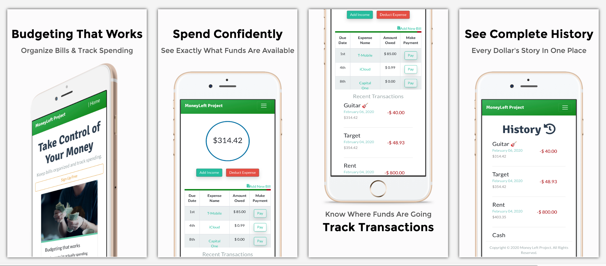

# Money Left Project
This application was created to help users manage the money they have left and was designed to give users the ability to track how much money they spend / receive as well as track their reoccuring bills.
Bringing the act of balancing a checkbook into the 21st century this is a solution that will help users stay up to date with all their financial needs without needing a connection to their bank account.

<strong>To start</strong>: Add your starting balance by clicking the "ADD INCOME" button. Next enter the name of the source in the "From" section (ie. Savings, Payday, etc.) and then amount of money you would like to add. After all information entered click the "ADD INCOME" button to submit. Once there's a starting balance, tracking how funds are moving comes next.

<strong>Adding Reoccurring Bills</strong>: Start by clicking the "ADD NEW BILL" link. Enter the name of your bill, the amount that's due (the more accurate the informtion the better) and lastly enter the next due date of the monthly bill. Once all information has been completed submit the bill with the "ADD BILL" button and repeat this process as many times as needed. Once all bills have been entered you are now ready to enjoy the benefits of this app.
